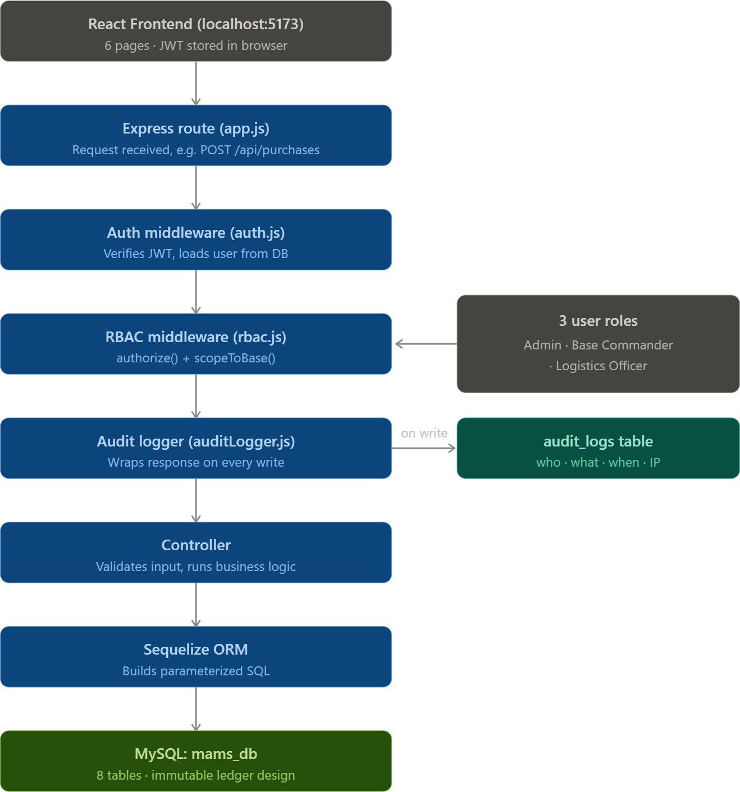

# Military Asset Management System (MAMS)

A full-stack system for tracking the movement, assignment, and expenditure of
military assets (vehicles, weapons, ammunition) across multiple bases, with
role-based access control and a full audit trail.

## 1. Architecture at a glance

```
military-asset-management/
├── backend/            Node.js + Express REST API
│   ├── src/
│   │   ├── config/db.js         Sequelize + MySQL connection
│   │   ├── models/               ORM models (User, Base, EquipmentType,
│   │   │                         Purchase, Transfer, Assignment,
│   │   │                         Expenditure, AuditLog)
│   │   ├── middleware/
│   │   │   ├── auth.js           JWT verification
│   │   │   ├── rbac.js           Role checks + base-scoping
│   │   │   └── auditLogger.js    Writes every mutating call to audit_logs
│   │   ├── controllers/          Business logic per feature
│   │   └── routes/               Express routers
│   ├── seed/seed.js              Equipment, and one user per role
│   └── schema-reference.sql      DB schema
├── frontend/            React (Vite) SPA
│   └── src/
│       ├── api/axios.js          Axios instance with JWT interceptor
│       ├── context/AuthContext.jsx
│       ├── components/           Navbar, FilterBar, MetricCard, Modal, ...
│       └── pages/                Login, Dashboard, Purchases, Transfers,
│                                  Assignments
└── README.md            (this file)
```

## 2. Tech stack, and why

 * Backend: Node.js + Express
Express keeps the routing/middleware/controller separation explicit, which is
what RBAC and audit logging need — both are implemented as composable
middleware rather than scattered `if` checks inside controllers. It's also
the fastest stack to review and extend for a small logistics team.

**Database: MySQL (relational), via Sequelize ORM**
This system is fundamentally about **counting things correctly over time and
across locations** — opening/closing balances, net movement, who has what.
That's a relational problem with hard invariants:
- A transfer must reference two *existing* bases and one *existing*
  equipment type → enforced with foreign keys.
- Quantities must never be negative → enforced with `CHECK (quantity > 0)`.
- Reports need to `SUM(...)` and `GROUP BY` across purchases/transfers/
  assignments/expenditures simultaneously → SQL aggregation is the natural
  fit; a document store would mean re-deriving these joins in application
  code.

A NoSQL store would make the audit trail *easier* to write but *harder* to
prove correct — you'd lose the DB-level guarantees against orphaned records
or double-counted stock.

**Design pattern: immutable ledger, not a mutable "balance" column.**
There is no `current_stock` field anywhere. `purchases`, `transfers`,
`assignments`, and `expenditures` are append-only tables. Every balance
number shown in the UI (Opening, Closing, Net Movement) is *computed* on
request by summing rows before/within a date range:

```
Opening Balance   = Σ(purchases before start) + Σ(transfers in before start)
                    − Σ(transfers out before start) − Σ(expenditures before start)
Net Movement      = Σ(purchases in range) + Σ(transfers in range)
                    − Σ(transfers out in range)
Closing Balance   = Opening Balance + Net Movement − Σ(expenditures in range)
Assigned          = Σ(assignments in range)   [assigned assets stay on base]
Expended          = Σ(expenditures in range)  [expended assets leave inventory]
```

This means:
- Nothing can be silently overwritten — every movement is a permanent,
  attributable row (`created_by`, timestamp).
- Any historical date range can be re-derived correctly at any time, which is
  exactly what "transparency and accountability" requires.
- It directly mirrors how the requirements describe the business itself
  ("Net Movement = Purchases + Transfers In − Transfers Out").

See `backend/src/controllers/dashboardController.js` for the implementation,
and `backend/schema-reference.sql` for the full DDL.

* Auth: JWT , stateless, role embedded in the token payload and re-verified
against the DB on every request (so deactivating a user takes effect
immediately, not just at next login).

*Frontend: React + Vite , plain CSS (no framework lock-in), Axios,
React Router. Kept deliberately dependency-light so it's easy to read and
extend.

## 3. Role-based access control

| Role               | Dashboard | Purchases (write) | Transfers (write)              | Assignments/Expenditures |
|--------------------|:---------:|:------------------:|:-------------------------------|:-------------------------:|
| `admin`             | All bases |                  |  any base                     | any base                |
| `base_commander`    | Own base only (enforced server-side) |  (view only) |  only as source = own base | ✅ own base only |
| `logistics_officer` | All bases | any base                     | (view only)             

Enforcement happens in two layers (`backend/src/middleware/rbac.js`):
1. `authorize(...roles)` — a route-level allow-list. A `base_commander`
   hitting `POST /api/purchases` gets a `403` before the controller runs.
2. `scopeToBase` — even for allowed roles, a `base_commander`'s `baseId`
   query/body param is forced to their own base, so they cannot read or
   write another base's data by simply changing a request parameter.

## 4. API logging (auditability)

`middleware/auditLogger.js` wraps every `POST`/`PUT`/`PATCH`/`DELETE` route
and writes one row to `audit_logs` per call: who (`user_id`, `email`), what
(`action`, `method`, `endpoint`), the request body, the resulting status
code, and the IP address. `GET` requests aren't logged (would be noise) —
every state-changing action is.

## 5. Getting it running locally (with MySQL Workbench)

**Step 1 — Create the schema in Workbench**
1. Open MySQL Workbench and connect to your local server (the connection
   you normally use — usually `127.0.0.1:3306`, user `root`).
2. In the toolbar click the "Create a new schema" icon (a cylinder with a
   `+`), name it `mams_db`, and click Apply → Apply → Finish.
   That's it — you do **not** need to run `schema-reference.sql` by hand;
   Sequelize creates all the tables automatically the first time the
   backend starts (see Step 3). `schema-reference.sql` is there purely as
   documentation of the resulting design.

**Step 2 — Point the backend at it**
```bash
cd backend
cp .env.example .env
```
Open `.env` and set `DB_USER` / `DB_PASSWORD` to the same credentials you
use to log into Workbench (`DB_HOST=127.0.0.1`, `DB_PORT=3306`, and
`DB_NAME=mams_db` already match what you just created).

**Step 3 — Install, create tables, seed, run**
```bash
npm install                  # pulls in mysql2, express, sequelize, etc.
npm run dev                  # creates all tables in mams_db, then starts the API
```
Leave that running, then in a **second terminal**:
```bash
npm run seed                  # creates bases, equipment types, 3 users
```
(Seeding after the server's first run is fine — `sync()` will have already
created the tables. Refresh Workbench's schema view and you'll see all 7
tables under `mams_db` with data in them after this step.)

**Step 4 — Frontend**
```bash
cd frontend
cp .env.example .env
npm install
npm run dev

# http://localhost:5173
```
## 6. Key API endpoints

| Method | Endpoint                              | Who                             |
|--------|----------------------------------------|----------------------------------|
| POST   | `/api/auth/login`                     | anyone with valid credentials    |
| POST   | `/api/auth/register`                  | public, only (see section 8) |
| GET    | `/api/dashboard?startDate=&endDate=&baseId=&equipmentTypeId=` | authenticated |
| GET    | `/api/dashboard/net-movement-detail`  | authenticated (backs the popup)  |
| POST   | `/api/purchases`                      | admin, logistics_officer         |
| GET    | `/api/purchases`                      | authenticated (scoped)           |
| POST   | `/api/transfers`                      | admin, logistics_officer, base_commander (own base) |
| GET    | `/api/transfers`                      | authenticated                    |
| POST   | `/api/assignments`                    | admin, base_commander            |
| PATCH  | `/api/assignments/:id/return`         | admin, base_commander            |
| POST   | `/api/expenditures`                   | admin, base_commander            |
| POST   | `/api/users`                          | admin only (create a login)      |
| GET    | `/api/users`                          | admin only                       |
| PATCH  | `/api/users/:id/deactivate`           | admin only                       |
| GET    | `/api/bases`, `/api/equipment-types`  | authenticated (dropdown data)    |

## 8. Two account-creation paths: production

This project intentionally has **two different ways to get a login**, for two different situations:

| | self-registration | Production account creation |
|---|---|---|
| Where | `/register` page, public, no login needed | `/users` page, admin-only |
| Endpoint | `POST /api/auth/register` | `POST /api/users` |
| Role you get | Always `logistics_officer` — hardcoded server-side, cannot be changed by the client | Whichever role the admin assigns, including `admin` or `base_commander` |
| Purpose | Let someone evaluating the project (e.g. an interviewer) try it instantly without you handing out credentials | The actual way real accounts get provisioned |
| How to disable | Set `REGISTRATION_ENABLED=false` in `backend/.env`, or delete the `/register` route in `authRoutes.js` | N/A — always on, gated by `authorize('admin')` |

**Why not just let `/register` be the only way in?** Because letting anyone self-assign a role (even
implicitly) is exactly the privilege-escalation hole RBAC exists to close. The route is deliberately
crippled — it always creates the *lowest*-privileged, base-independent role — so it's safe to leave switched
on for a without undermining the access-control story. Before any real deployment, flip
`REGISTRATION_ENABLED` to `false`.

1. Log in as `admin@mams.mil`.
2. Open the **Users** tab in the navbar (visible only to admins).
3. Fill in name, email, password, role, and — for `base_commander` — which base they're assigned to.
4. The new account can log in immediately with the password you set.

Every creation through either path is recorded in `audit_logs` (`CREATE_USER`), so even the route
leaves an attributable trail.

## 7. What's intentionally out of scope for this first pass

- Migrations (using `sequelize.sync()` for simplicity — swap for
  `sequelize-cli` migrations before production).
- Refresh tokens / token revocation list.
- Pagination UI (API supports `page`/`limit`; the frontend tables currently
  render the first page for clarity in this initial framework).
- File/photo attachments on transfers.

These are natural next increments once the core ledger and RBAC model (the
hard part) is validated.

## Designing a full architecture diagram with layered components.

